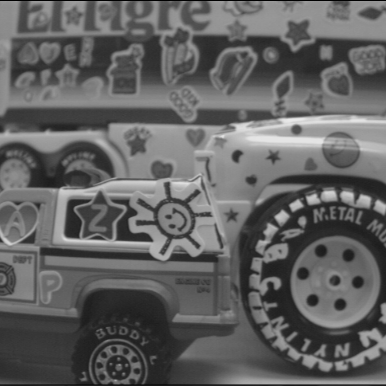
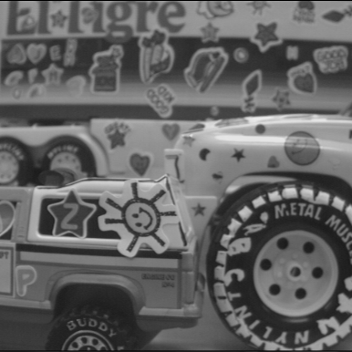
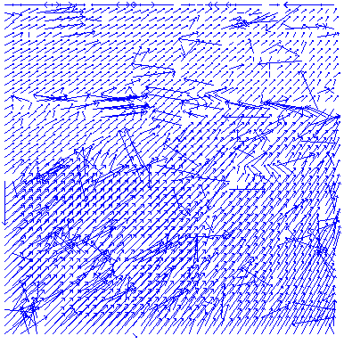
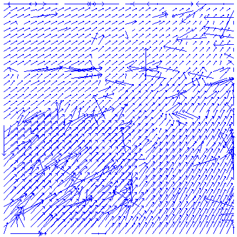
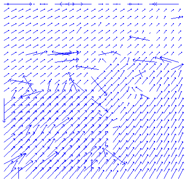
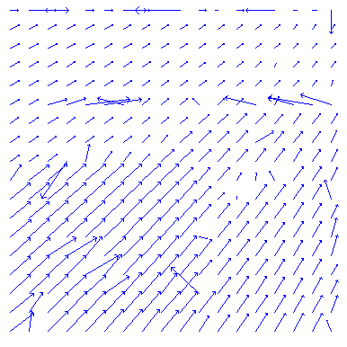
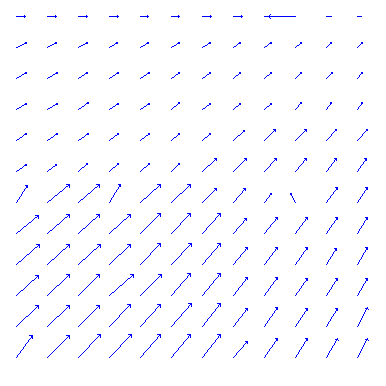

# Homework 1 - Image Matching (Detecting Motion Vectors)
### Origin Iamge
|||
|-|-|

### Usage
```
cd hw1
mkdir build && cd build
cmake ..
make
cd ..
./build/hw1 data/trucka.bmp data/truckb.bmp
```
All generated images are saved in `demo`

## Description
* Detect motions vectors between trucka.bmp and truckb.bmp.
* Use trucka.bmp as the basis, sample it by an `9×9` , `11×11`, `15×15`, `21×21`, `31×31` block.
* Threshold of search range: `50` pixels. (This is a reference value only!)
* Dimension of truck is `386×386` with 216 bytes of leading header.

## Result
|Block size|Motion Vectors Graph|
|-|-|
|9×9||
|11×11||
|15×15||
|21×21||
|31×31||