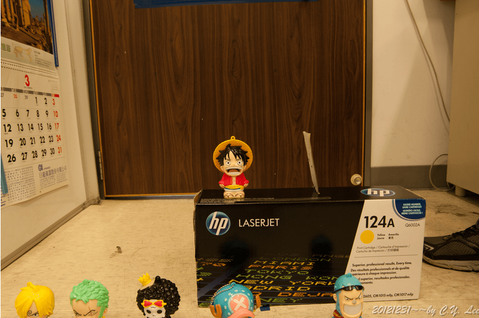

# Homework 2 - Camera Calibration

### Usage
```
cd hw2
wget http://cv2.csie.ntu.edu.tw/CV2/_private/photo.rar
unrar x photo.rar 
mkdir build && cd build
cmake ..
make
cd ..
./build/hw2
```
Manually select ROI to detect object displacement

Images of ROI selected are saved in `roi`

Measured data is saved in `output/output.csv` 

## Description
* Camera calibration i.e. compute object displacement(#mm/ pixel )
* Calculate horizontal field of view in degrees of angle.
* Calculate theoretical values (FOV) and compare with measured values
* Use lens of focal length: `18mm`, `53mm`, `135mm`
* Object displacement of: `1mm`, `5mm`, `10mm`, `20mm`
* Object distance of: `0.6m`, `1.2m`, `1.8m`
* Camera : `Pentax K-7, 18-135mm`
* Sensor size : `23.4 x 15.6 mm`


## Object Motion


## Result
|Focal length(mm)|Object distance(mm)|Object actual displacement(mm)|Object displacement(pixel)|mm/pixel|FOV theoretical value(degree)|FOV measured value(degree)|
|-|-|-|-|-|-|-|
|18|600|1|7|0.142857|66.0477|58.1648|
|18|600|5|26|0.192308|66.0477|73.6457|
|18|600|10|54|0.185185|66.0477|71.5823|
|18|600|20|101|0.19802|66.0477|75.2614|
|18|1200|1|2|0.5|66.0477|88.4516|
|18|1200|5|16|0.3125|66.0477|62.6271|
|18|1200|10|30|0.333333|66.0477|65.9582|
|18|1200|20|56|0.357143|66.0477|69.617|
|18|1800|1|3|0.333333|66.0477|46.7859|
|18|1800|5|9|0.555556|66.0477|71.5823|
|18|1800|10|19|0.526316|66.0477|68.6694|
|18|1800|20|42|0.47619|66.0477|63.4313|
|53|600|1|22|0.0454545|24.8973|20.0714|
|53|600|5|64|0.078125|24.8973|33.836|
|53|600|10|130|0.0769231|24.8973|33.3446|
|53|600|20|261|0.0766284|24.8973|33.2239|
|53|1200|1|10|0.1|24.8973|22.0316|
|53|1200|5|45|0.111111|24.8973|24.4097|
|53|1200|10|78|0.128205|24.8973|28.0264|
|53|1200|20|163|0.122699|24.8973|26.8674|
|53|1800|1|12|0.0833333|24.8973|12.3449|
|53|1800|5|37|0.135135|24.8973|19.8942|
|53|1800|10|58|0.172414|24.8973|25.2249|
|53|1800|20|101|0.19802|24.8973|28.8247|
|135|600|1|61|0.0163934|9.90651|7.30391|
|135|600|5|164|0.0304878|9.90651|13.5386|
|135|600|10|270|0.037037|9.90651|16.4107|
|135|600|20|506|0.0395257|9.90651|17.4969|
|135|1200|1|37|0.027027|9.90651|6.02341|
|135|1200|5|63|0.0793651|9.90651|17.5652|
|135|1200|10|141|0.070922|9.90651|15.7213|
|135|1200|20|314|0.0636943|9.90651|14.1362|
|135|1800|1|4|0.25|9.90651|35.9507|
|135|1800|5|33|0.151515|9.90651|22.2486|
|135|1800|10|88|0.113636|9.90651|16.7784|
|135|1800|20|211|0.0947867|9.90651|14.0257|
