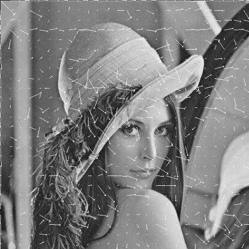
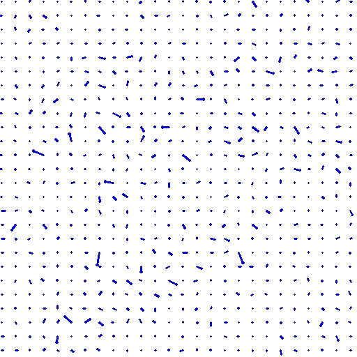
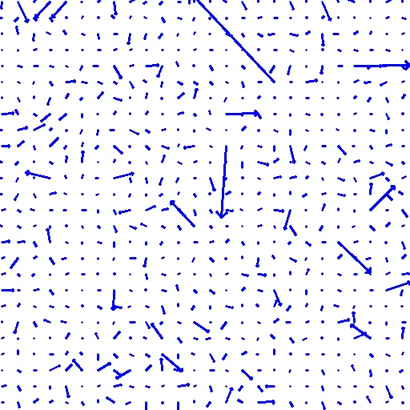
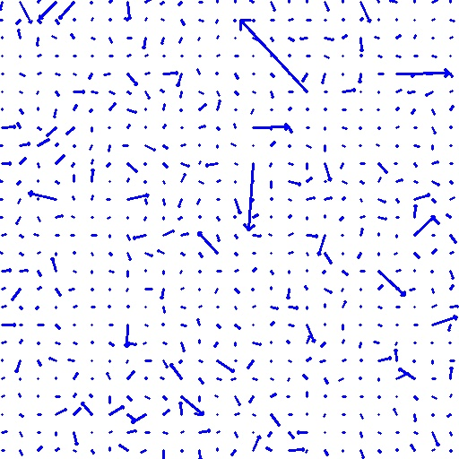
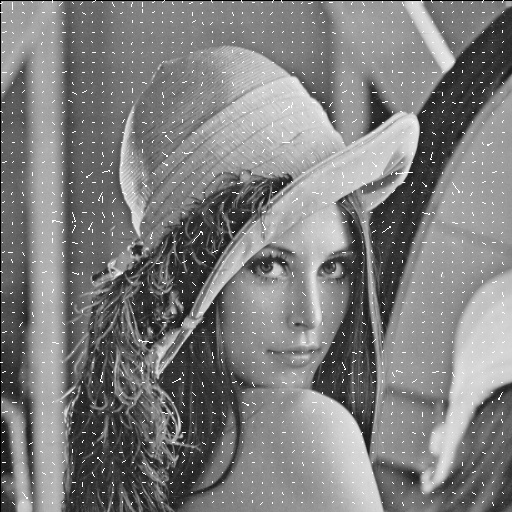
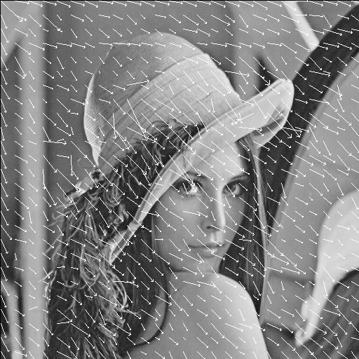
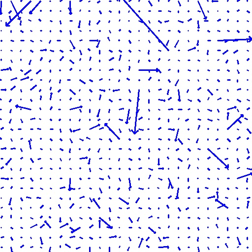
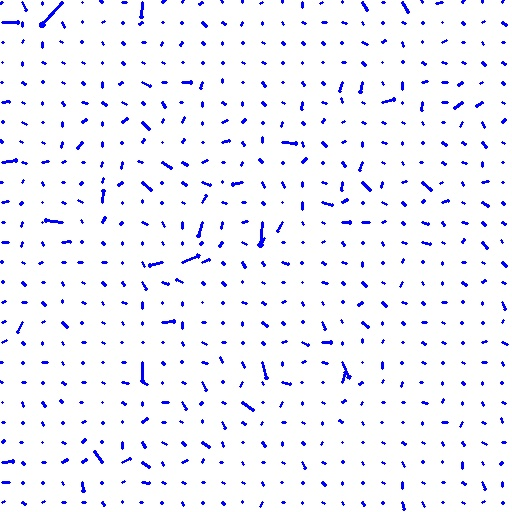
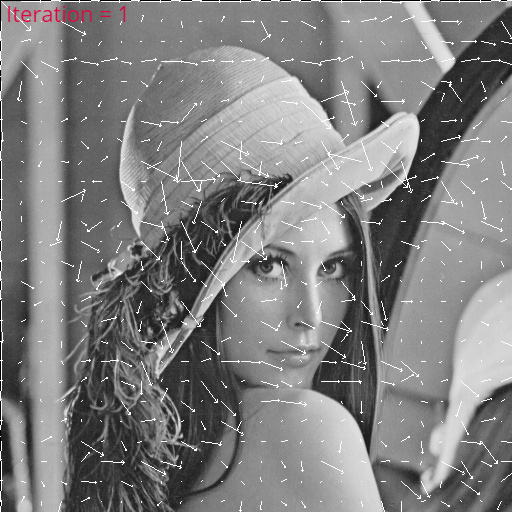

# Homework 3 - Calculating Optical Flow

### Origin Iamge


### Usage
```
cd hw3
mkdir build && cd build
cmake ..
make
cd ..
./build/hw3 data/lena.bmp
```
All generated images are saved in `demo`

## Description
* Implement Horn & Schunck optical flow estimation.
* Synthetically translate lena.bmp one pixel to the right and downward.
* Try λ of `0.1`, `1`, `10`.
* For each λ, show the result after `1`, `4`, `16`, `64` iterations.

## Result
|Iteration|lambda = 0.1|lambda = 1|lambda = 10|
|-|-|-|-|
|1||||
|4||||
|16||||
|64||||

## Lambda = 0.1 changes with increasing iterations 

